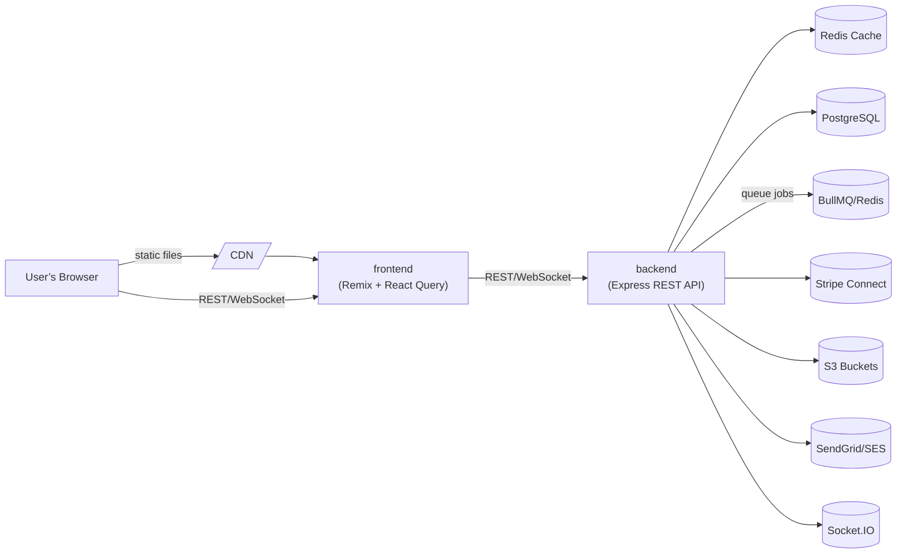
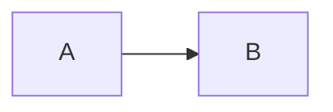

# Revendiste

This repository contains the code for an MVP, designed to support individual buyers and sellers with future extensibility for official ticket sales and resale.

## Table of Contents

* [Features](#features)
* [Tech Stack](#tech-stack)
* [System Architecture](#system-architecture)
* [Getting Started](#getting-started)
* [Mermaid Diagrams in Markdown](#mermaid-diagrams-in-markdown)

## Features

* User registration and authentication
* Listing tickets for sale
* Browsing and purchasing listings
* Payment escrow via Stripe Connect
* Email and push notifications

## Tech Stack

* **Frontend**: Tanstack Start, TypeScript, React Query (TanStack Query)
* **Backend**: Express, PostgreSQL, Kysely
* **Shared**: Zod schemas and TypeScript types
* **Infrastructure**: Redis (cache/queues), S3 (assets), Stripe Connect (payments)
* **CI/CD**: GitHub Actions, ESLint, Prettier

## System Architecture

Below is a high-level overview of the system architecture:



## Getting Started

1. **Clone the repo**

   ```bash
   git clone https://github.com/your-org/ticket-resale.git
   cd ticket-resale
   ```

2. **Install dependencies**

   ```bash
   pnpm install
   ```

3. **Configure environment**
   Copy `.env.example` to `.env` and fill in your API keys and database URL.

4. **Run database migrations**

   ```bash
   pnpm run migrate
   ```

5. **Start development servers**

   ```bash
   # Frontend
   pnpm --filter frontend dev

   # Backend
   pnpm --filter backend dev
   ```

## Mermaid Diagrams in Markdown

Yes—you can render Mermaid diagrams directly in Markdown using fenced code blocks labeled `mermaid`. Many platforms (like GitLab, Obsidian, VSCode, and more recently GitHub) support this natively or via plugins. For example:

````markdown


When viewed in a compatible renderer, the above block will display the rendered diagram instead of the raw code.

```
